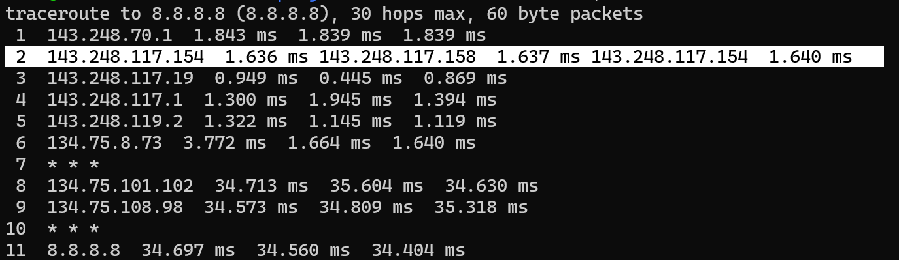
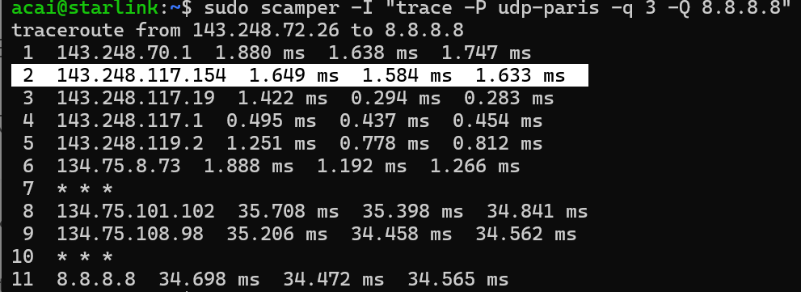

# Traceroute Practice

## Command

traceroute -n 8.8.8.8

We use 3 probe packets for each TTL (Time To Live). 
We use UDP (User Datagram Protocol) by default in Linux.

## ECMP: One Type of Load Balancer
### Equal Cost Multi Path
#### ECMP uses hashing based on the 5-tuple: (Source IP, Destination IP, Source Port, Destination Port, Protocol). This 5-tuple is commonly used to identify a flow. ECMP uses hashing on this 5-tuple to select one of the equal-cost paths.
#### For example, even though the source and destination IP addresses are the same, the probe packets use different router IP addresses.

#### This happens because we use different ports for each probe packet.  

#### We can solve this problem using "Paris Traceroute," as shown below.

